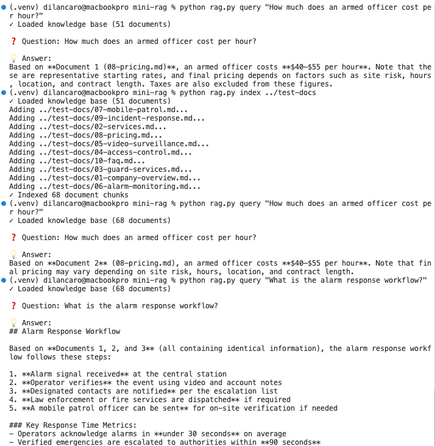

# Contribution [#]: [Issue Title]

**Contribution Number:** [1 / 2 / 3]  
**Student:** Dilan Caro  
**Issue:** [https://github.com/josharsh/100LinesOfAICode/issues/19]  
**Status:** [Phase I ] [Complete]

---

## Why I Chose This Issue

The issue is about implementing a webui for a cli tool. There are various cli tools in this repo. Some of them are mini-rag, so implementing the webui would actually be really fun and not complicated so we can stay ahead and finish all phases. In the case I finish too quickly I hope to implement other web uis for other tools here like rubber-duck cli tool for rubber duck debbuging !

I have various skills, full stack, web, backend , so actually I think it is a nice issue to practice the full pipeline , for the backend, I can understand it, or even modify it if required, and the web ui I can implement it with my web skills and AI if needed. 

I hope to learn how to make streamline web ui , easy , nice, simple, and functional.

---

## Understanding the Issue

### Problem Description

Mini RAG ships as a command-line tool only. To index documents or ask a question, a user has to open a terminal, set an environment variable, and run `python rag.py index ...` / `python rag.py query "..."`. This is a barrier for non-technical users and makes the tool hard to demo. There is no graphical way to upload documents or chat with the knowledge base.

### Expected Behavior

A user should be able to open a browser, upload `.txt` or `.md` files, index them with one click, and then ask questions in a chat-style interface — without touching the command line. Answers should still be grounded in the uploaded documents and cite their sources, exactly like the CLI does.

### Current Behavior

All interaction happens through the terminal:
- Indexing requires running `python rag.py index <file|dir>`.
- Querying requires running `python rag.py query "<question>"`.
- The API key must be exported manually each session.
- There is no visual feedback, no upload widget, and no chat view.

### Affected Components

- `mini-rag/rag.py` — the `MiniRAG` class (`add_file`, `add_directory`, `query`, `save`, `load`) that the web layer must reuse.
- `mini-rag/knowledge_base.json` — persisted index that should be shared between CLI and web.
- `mini-rag/web/app.py` — **new** Flask layer providing the UI and the `/upload` and `/ask` endpoints.
- `mini-rag/web/uploads/` — **new** directory where uploaded documents are stored.

---

## Reproduction Process

### Environment Setup


I cloned my fork and worked inside the `mini-rag/` tool directory. Setup was lightweight since Mini RAG has no vector DB dependency — it only needs `anthropic` and `numpy`.
```bash
python -m venv .venv
source .venv/bin/activate          # Windows: .venv\Scripts\activate
pip install anthropic numpy
export ANTHROPIC_API_KEY=your_key  # I put mine in a .env file instead


### Steps to Reproduce

1. Index a folder of documents into the knowledge base:
   ```bash
   python rag.py index ./test-docs
   ```
2. Ask a question against the indexed documents:
   ```bash
   python rag.py query "What guard services are offered?"
   ```
3. **Observed result:** The tool loads `knowledge_base.json`, retrieves the top-3 most relevant chunks via the hybrid embedding + keyword search, sends them to Claude, and prints a concise, source-cited answer (e.g. "Based on Document 1 ..."). This confirms the original Mini RAG behavior reproduces correctly before building the web UI on top of it.

### Reproduction Evidence

- **Commit showing reproduction:**  https://github.com/DilanCaro/100LinesOfAICode

- **Screenshots/logs:**

  

- **My findings:**
  - The retrieval is intentionally simple — a 100-dim hash-based word-frequency "embedding" blended 30% with keyword overlap (70%). No external vector database is required, which is what keeps it under 100 lines.
  - Answers are grounded: the prompt instructs Claude to use only the provided documents and to cite the document number, so out-of-scope questions return "I don't have that information."
  - Because the knowledge base persists to `knowledge_base.json`, the same indexed state could be reused directly by the web UI — which is what makes the web extension straightforward.
---

## Solution Approach

### Analysis

The root cause is not a bug — it's a missing interface. All of Mini RAG's logic lives in the `MiniRAG` class (`add_file`, `add_directory`, `query`, `save`, `load`), but the only caller is the `main()` CLI driver in `rag.py`. There is no programmatic entry point exposed over HTTP, so the only way to reach `MiniRAG` is through the terminal. Two smaller friction points reinforce this: the API key had to be exported manually, and the index lived only in a local `knowledge_base.json` with no upload path.

### Proposed Solution

Add a thin web layer that reuses the existing `MiniRAG` class without modifying its core logic:
- A single Flask app (`mini-rag/web/app.py`) that serves an HTML/Tailwind chat UI and exposes two JSON endpoints — `/upload` (index files) and `/ask` (query).
- A small `.env` loader so the API key is picked up automatically (added to both `rag.py` and the web app).
- Reuse of `knowledge_base.json` and `MiniRAG.save/load` so the web index persists across restarts and stays compatible with the CLI.

### Implementation Plan

Using UMPIRE framework (adapted):

**Understand:** Mini RAG works only from the command line. Users need a browser-based way to upload `.txt`/`.md` files, index them, and ask questions, while keeping answers grounded and source-cited exactly like the CLI.

**Match:** The CLI `main()` in `rag.py` already demonstrates the full flow: load `knowledge_base.json`, call `add_file`/`add_directory`, `save`, and `query`. The web layer mirrors that exact sequence over HTTP. Other tools in this repo follow the "single-file, minimal dependency" convention, so the web app stays in one `app.py` and reuses `MiniRAG` rather than reimplementing retrieval.

**Plan:**
1. Add a `.env` loader to `rag.py` so `ANTHROPIC_API_KEY` is read from the repo root automatically (and fail fast with a clear message if missing).
2. Create `mini-rag/web/app.py`: a Flask app that appends the parent dir to `sys.path`, imports `MiniRAG`, loads the existing `knowledge_base.json` if present, and serves the chat UI via `render_template_string`.
3. Implement `POST /upload`: accept multiple files, `secure_filename` them, save to `web/uploads/`, call `rag.add_file()` per file, then `rag.save()`.
4. Implement `POST /ask`: validate the question, check the API key, call `rag.query()`, and return JSON (with error handling).
5. Verify end-to-end against the `test-docs/` security-services content.

**Implement:** [Link to your branch/commits as you work]

**Review:** Self-review checklist:
- [ ] Reuses `MiniRAG` instead of duplicating retrieval logic.
- [ ] Stays minimal and dependency-light (`flask` only added on top of `anthropic` + `numpy`), consistent with the repo's style.
- [ ] No secrets committed — API key comes from `.env`, which is gitignored.
- [ ] Uploaded filenames sanitized with `secure_filename`; only `.txt`/`.md` accepted.
- [ ] Index persists to and loads from the same `knowledge_base.json` as the CLI.
- [ ] Follows `CONTRIBUTING.md` (branch naming, commit messages, line-count spirit of the project).

**Evaluate:** Verification steps:
1. Run `python web/app.py` and open `http://localhost:5000`.
2. Upload files from `test-docs/` and confirm the status shows "Indexed N chunks."
3. Ask a question (e.g. "What guard services are offered?") and confirm the answer is grounded and cites a document.
4. Ask an out-of-scope question and confirm it returns "I don't have that information."
5. Restart the server and confirm the previously indexed knowledge base still loads.
6. Cross-check that the same `knowledge_base.json` still works from the CLI (`python rag.py query "..."`).

---

## Testing Strategy

### Unit Tests

- [ ] Test case 1: [Description]
- [ ] Test case 2: [Description]
- [ ] Test case 3: [Description]

### Integration Tests

- [ ] Integration scenario 1
- [ ] Integration scenario 2

### Manual Testing

[What you tested manually and results]

---

## Implementation Notes

### Week [X] Progress

[What you built this week, challenges faced, decisions made]

### Week [Y] Progress

[Continue documenting as you work]

### Code Changes

- **Files modified:** [List]
- **Key commits:** [Links to important commits]
- **Approach decisions:** [Why you chose certain approaches]

---

## Pull Request

**PR Link:** [GitHub PR URL when submitted]

**PR Description:** [Draft or final PR description - much of the content above can be adapted]

**Maintainer Feedback:**
- [Date]: [Summary of feedback received]
- [Date]: [How you addressed it]

**Status:** [Awaiting review / Iterating / Approved / Merged]

---

## Learnings & Reflections

### Technical Skills Gained

[What you learned technically]

### Challenges Overcome

[What was hard and how you solved it]

### What I'd Do Differently Next Time

[Reflection on your process]

---

## Resources Used

- [Link to helpful documentation]
- [Tutorial or Stack Overflow post that helped]
- [GitHub issues or discussions that helped]
